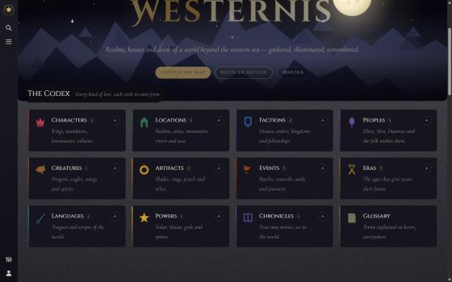
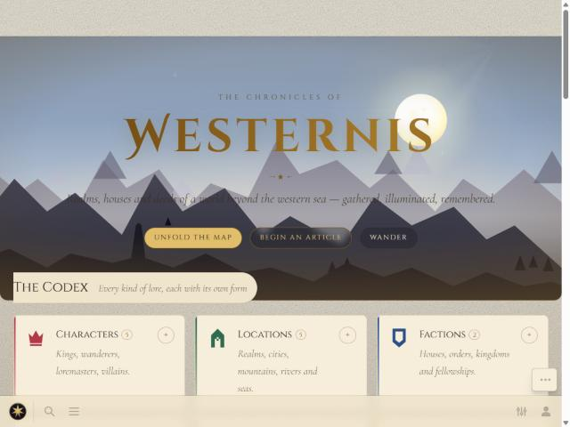
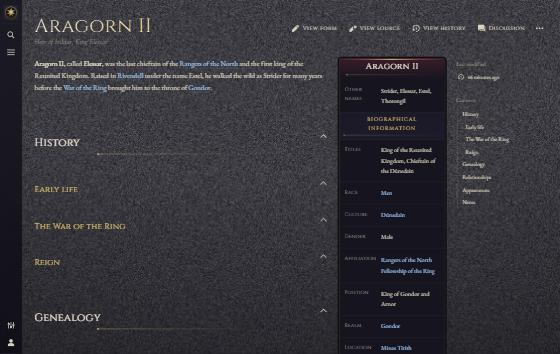
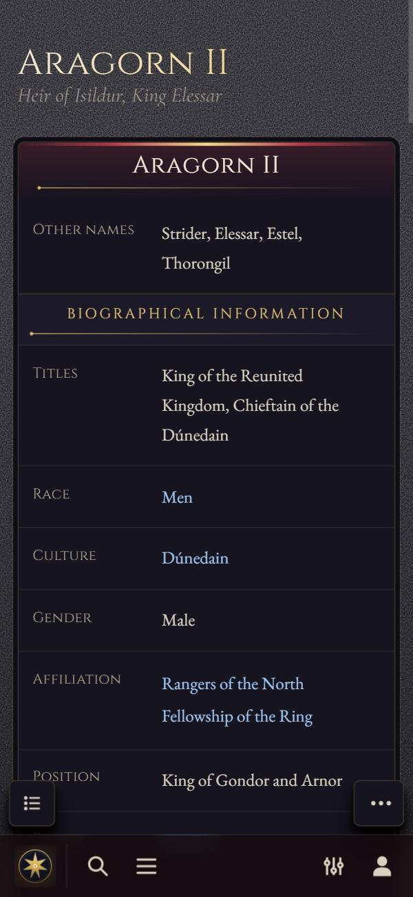
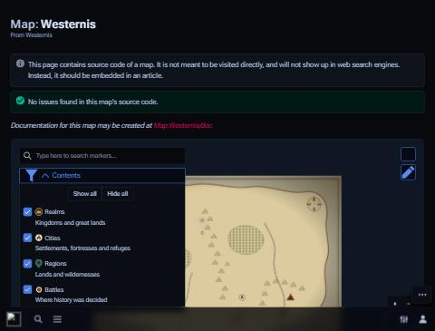

# Westernis

[](https://github.com/shiftbloom-studio/westernis/actions/workflows/ci.yml)
[](LICENSE)
[](content/LICENSE.md)

**A self-hosted worldbuilding wiki for your own corner of Middle-earth.** Westernis is a
ready-to-run MediaWiki 1.46 setup for Docker: Fandom-style portable infoboxes, WorldAnvil-style
article forms, interactive maps, timelines, family trees, an illuminated-manuscript theme on the
Citizen skin, and an MCP server so that Claude Code can research, write and link articles with you.

> **Language:** the wiki interface and the sample content are **German** by default
> (`WIKI_LANG=de`); every user can pick another interface language in the preferences.
> Code, comments and this documentation are English.
>
> Westernis is an **unofficial fan project**, not affiliated with the Tolkien Estate or
> Middle-earth Enterprises. See the [disclaimer](#disclaimer).

## Screenshots

| Night (default) | Day | Article | Mobile | Map |
| --- | --- | --- | --- | --- |
|  |  |  |  |  |

The screenshots were taken before the switch to the German interface.

## Features

- **Eleven entity types** (character, location, faction, people, creature, artifact, event, era,
  language, power, chronicle), each with an infobox, a Cargo table, a form, a category with a
  *create* box, an article skeleton and an MCP schema, all generated from one file.
- **Structured data:** every infobox field is queryable through Cargo; Page Forms create pages.
- **Maps** on your own images (DataMaps), **timelines**, **family trees**, relationship tables,
  glossary tooltips, hover previews, tabs and link graphs.
- **Theme:** an illuminated manuscript with night (Mondlicht) and day (Pergament) modes,
  self-hosted fonts, gilt ornaments and a parallax hero; it respects `prefers-reduced-motion`.
- **AI tooling:** the *westernis-forge* MCP server and two Claude Code skills write lore that is
  consistent with what the wiki already says.
- **Sample content:** German summaries of Tolkien's legendarium as scaffolding for your own world.

## Quick start

Prerequisites: [Docker](https://docs.docker.com/get-docker/) with Compose v2,
PowerShell 7 (`pwsh`; install it from <https://aka.ms/powershell> if missing; it runs on Windows,
macOS and Linux) and, for the MCP server and the generators, Node.js 22 or newer.

```sh
git clone https://github.com/shiftbloom-studio/westernis.git
cd westernis
pwsh ./scripts/wiki.ps1 init    # creates .env from .env.example with fresh random secrets
pwsh ./scripts/wiki.ps1 up      # builds the image, starts the stack, bootstraps DB + admin + bot password + seed
```

Open <http://localhost:8088> and log in with the user from `.env` → `WIKI_ADMIN_USER` (default
`Admin`) and the password from `.env` → `WIKI_ADMIN_PASSWORD`. The first `up` takes a few minutes.

Instead of `init` you can copy `.env.example` to `.env` and fill in every `<...>` value yourself
(`openssl rand -hex 32` makes a good secret). `up` refuses to start while placeholders remain.

## Daily use

| What | Where |
| --- | --- |
| The wiki (this computer) | `http://localhost:8088` |
| The wiki (other devices on your network) | `http://<your-LAN-IP>:8088` (set `.env` → `WIKI_SERVER` to that URL) |
| Login | user from `.env` → `WIKI_ADMIN_USER` (default `Admin`), password `.env` → `WIKI_ADMIN_PASSWORD` |
| Create an article | `Westernis:Create` ("Einen Eintrag beginnen") or the **Neuer Eintrag** box on any root category |
| World map | `Weltkarte` (the reader's view); markers live on `Karte:Westernis` (= `Map:Westernis`, JSON; pencil button) |
| Style and canon rules | `Westernis:Manual of Style`, `Westernis:Canon`, `Westernis:AI workflow` |
| Language | German by default (`.env` → `WIKI_LANG=de`); each user can pick another interface language in the preferences |

## Configuration

All settings live in `.env` (git-ignored; [`.env.example`](.env.example) documents every key).
Changes take effect after `pwsh ./scripts/wiki.ps1 up`.

| Key | Default | Meaning |
| --- | --- | --- |
| `WIKI_SITENAME` | `Westernis` | Site name |
| `WIKI_LANG` | `de` | Content and default interface language |
| `WIKI_HOST_PORT` | `8088` | Port on the host |
| `WIKI_SERVER` | `http://localhost:8088` | Canonical URL; use `http://<your-LAN-IP>:8088` so links work from other devices |
| `WIKI_TIMEZONE` | `Europe/Berlin` | Wiki time zone |
| `MARIADB_DATABASE`, `MARIADB_USER` | `westernis` | Database name and user |
| `MARIADB_PASSWORD`, `MARIADB_ROOT_PASSWORD` | (secret) | Database passwords |
| `WIKI_SECRET_KEY` | (secret, required) | MediaWiki `$wgSecretKey`; the wiki refuses to start without it |
| `WIKI_UPGRADE_KEY` | (secret, optional) | Unlocks the web upgrader; unset keeps it locked |
| `WIKI_ADMIN_USER`, `WIKI_ADMIN_PASSWORD` | `Admin`, (secret) | Administrator account created on the first `up` |
| `WIKI_BOT_APPID`, `WIKI_BOT_PASSWORD` | `Forge`, (secret, at least 32 characters) | Bot password the MCP server logs in with |
| `WIKI_API` | `http://localhost:${WIKI_HOST_PORT}/api.php` | API endpoint the MCP server uses |
| `WIKI_DEBUG` | `0` | `1` shows stack traces on error pages; keep `0` on any public server |
| `WIKI_SOURCE_URL` | this repository | Source-code link in the footer (AGPL section 13); point it at your fork if you change the code |
| `WIKI_RIGHTS_URL`, `WIKI_RIGHTS_TEXT` | empty | Optional licence notice for your wiki's own pages in the footer |

PHP settings that do not fit into `.env` go into the untracked `wiki/LocalSettings.local.php`,
which `LocalSettings.php` loads last.

## Operations

```sh
pwsh ./scripts/wiki.ps1 init         # first run: create .env with random secrets
pwsh ./scripts/wiki.ps1 up           # start (builds on first run, bootstraps DB + admin + bot password + seed)
pwsh ./scripts/wiki.ps1 down         # stop (data stays in Docker volumes)
pwsh ./scripts/wiki.ps1 status       # container status (the default command)
pwsh ./scripts/wiki.ps1 sync         # push edited LocalSettings / assets / scripts / content into running containers
pwsh ./scripts/wiki.ps1 seed         # re-import ./content (templates, forms, theme pages, sample lore)
pwsh ./scripts/wiki.ps1 seed -ForceFiles   # ... and re-upload the artwork in content/files
pwsh ./scripts/wiki.ps1 backup       # DB dump + uploads + XML dump into ./backups/<timestamp>
pwsh ./scripts/wiki.ps1 restore ./backups/20261005-160000
pwsh ./scripts/wiki.ps1 logs | shell | restart | update | purge-cache | rebuild | bootstrap
```

On Windows you can also call it as `.\scripts\wiki.ps1 up`. `backup` and `restore` currently use
`cmd.exe` for the stream redirection and therefore run on Windows only.

Backups contain a copy of your `.env` (passwords, secret key): keep `backups/` out of git
(it is ignored) and never share it. The script keeps the ten newest backups.

## AI tooling (Claude Code)

[`.mcp.json`](.mcp.json) registers the **westernis-forge** MCP server
([`tools/forge-mcp`](tools/forge-mcp/package.json), Node, no build step). Install its
dependencies once, then open Claude Code in the project folder so the relative path resolves:

```sh
npm ci --prefix tools/forge-mcp
```

The server reads the bot password from `.env` and offers 19 tools: `wiki_site_info`,
`wiki_search`, `wiki_get_page`, `wiki_get_pages`, `wiki_lore_context`, `wiki_entity_schema`,
`wiki_cargo_query`, `wiki_list_category`, `wiki_links_here`, `wiki_wanted_pages`,
`wiki_recent_changes`, `wiki_suggest_links`, `wiki_preview`, `wiki_save_page`,
`wiki_edit_section`, `wiki_create_entity`, `wiki_lint_article`, `wiki_upload_file`, `wiki_purge`.

Skills: `/wiki-article` (write or extend one article consistently with existing lore) and
`/lore-sweep` (groom the red-link backlog, write batches, audit consistency), in
[`.claude/skills`](.claude/skills/wiki-article/SKILL.md). Ask, for example, *"gather what we know
about Gondor and draft Ithilien"*. Pages the AI creates start as `canon=Draft`.

Cargo queries from the server: `wiki_cargo_query` with `tables="Characters"`,
`fields="_pageName,race"`, `where="realm='Gondor'"`; list fields use `HOLDS`.

Tests (in `tools/forge-mcp`):

| Command | Needs a wiki | What it does |
| --- | --- | --- |
| `npm test` | no | Starts the server offline and checks the tool list and entity schemas |
| `npm run smoke` | yes, **writes** | API client: login, edit `Notes:Forge smoke test`, read back |
| `npm run test:live` | yes, **writes** | Drives every tool through a real MCP client; writes `Notes:Forge test/*` |

## Entity types and generators

Character · Location · Faction · People · Creature · Artifact · Event · Era · Language · Power ·
Chronicle (your own stories, in the `Chronicle:` namespace). Each type has an infobox template, a
Cargo table, a form, a category with a **Create** box, an article skeleton, and an MCP schema.
All of them are generated from **one file**, `tools/gen-entities/entities.js`; the German display
layer (labels, section titles, dropdown display values) is `tools/gen-entities/de.js`.
Identifiers (template, field, category and Cargo names, stored values) stay English.

```sh
node tools/gen-entities/generate.js   # templates, forms, categories, skeletons, label module, MCP schema
node tools/gen-entities/samples.js    # sample articles, glossary, help and project pages
pwsh ./scripts/wiki.ps1 sync; pwsh ./scripts/wiki.ps1 seed
```

Generated files are never edited by hand; CI checks that they match their sources
(see [CONTRIBUTING.md](CONTRIBUTING.md#generated-files-edit-the-generator-not-the-output)).

Useful templates: `{{Timeline|era=Third Age}}`, `{{Family tree}}`, `{{Relationships}}`,
`{{Appearances}}`, `{{Quote|text|who|work}}`, `{{Secret|title=|text=}}`, `{{Drop cap|T}}`,
`{{Divider}}`, `{{Map:Westernis}}`.

The artwork is generated too, by the seeded, deterministic scripts in `tools/brand`
(`npm ci --prefix tools/brand` first): `make-hero.js` (landscape layers, night and dawn),
`make-map.js` (the world chart, SVG) and `raster-map.js` (its WebP, which the map page shows),
`make-ornaments.js` (mask ornaments), `make-icons.js` (entity icons, dividers) and
`make-wordmark.js` (logo). `npm run all --prefix tools/brand` runs them all; re-upload the map
with `seed -ForceFiles`.

## What is inside

| Layer | Choice | Why |
| --- | --- | --- |
| Engine | MediaWiki **1.46.0** (official image, PHP 8.3), MariaDB **LTS**, memcached | Newest stable; the same engine behind Fandom; one shared cache for web, jobs and CLI |
| Skin | **Citizen 3.24** | Modern, responsive, command palette (press `/`), dark/light, token-based theming |
| Infoboxes | **PortableInfobox** (Fandom's own, ported) | The "wikia" look, themed per entity type |
| Structured data | **Cargo** + **Page Forms** | Every infobox field becomes a queryable table; forms create pages |
| Maps | **DataMaps** | Leaflet maps on your own images, marker groups, search |
| Lists and previews | DynamicPageList4, Popups, RelatedArticles, ShortDescription, TabberNeue, Lingo | Hover previews, tabs, glossary tooltips, taglines |
| Diagrams | Mermaid, Network | Charts and link graphs (`Special:Network`, or `{{#network:Page name}}` in an article) |
| Editing | VisualEditor, WikiEditor + CodeMirror, MsUpload, SimpleBatchUpload, CharInsert | Visual and source editing, drag-and-drop uploads |
| Lua | Scribunto (LuaSandbox) | `Module:Westernis` (dates, links), `Module:Family` (family trees) |

Bundled extras: Cite, Math (native MathML), SyntaxHighlight, Gadgets, CategoryTree, ImageMap,
InputBox, MultimediaViewer, PdfHandler (with Ghostscript/Poppler), Poem, ReplaceText, Nuke,
TemplateData, TemplateStyles, TextExtracts, PageImages, DisplayTitle, LabeledSectionTransclusion.
The skin and extensions are fetched at build time, pinned to tags or commits, in
[`docker/mediawiki/Dockerfile`](docker/mediawiki/Dockerfile).

## Project layout

```
docker-compose.yml          db (MariaDB) · cache (memcached) · wiki (MediaWiki) · jobrunner
docker/mediawiki/           Dockerfile (skin + extensions pinned), Apache short URLs, PHP limits
wiki/LocalSettings.php      all wiki configuration (baked into the image; `sync` pushes edits)
wiki/assets/                fonts (WOFF2; OFL-1.1, Tengwar Telcontar GPL-3.0-or-later), brand SVGs, theme JS, images
content/pages/<NS>/         seed pages: Template, Form, Module, Category, MediaWiki (theme CSS/JS), Main, Map, …
content/files/              seed uploads (map image, marker icons)
scripts/                    wiki.ps1 (control), wiki-bootstrap.sh, wiki-seed.sh (run inside the container)
tools/gen-entities/         entities.js (single source of truth) + de.js (German display layer) + generate.js + samples.js
tools/forge-mcp/            the MCP server + schemas.json + offline test
tools/brand/                art generators (hero, map, ornaments, icons, wordmark)
third_party/                original files of bundled third-party fonts (corresponding source)
.claude/skills/             wiki-article, lore-sweep
.env                        secrets and host settings (not committed; see .env.example)
```

## How it works

* **No bind mounts.** Config and assets are copied into the image, so the stack also runs where
  the project folder is not shared with the Docker daemon (Docker Desktop on Windows, for
  example). `wiki.ps1 sync` uses `docker cp` for instant iteration; `wiki.ps1 up` rebuilds only
  the last, thin image layers.
* Uploads live in the `westernis_wiki_images` volume, the database in `westernis_db_data`.
  Back them up with `wiki.ps1 backup`; the XML dump is portable insurance.
* **Theme**, an illuminated manuscript: `content/pages/MediaWiki/Common.css` is the design system
  (palette tokens via `light-dark()`, EB Garamond with true small caps and old-style figures,
  Cinzel titles, gilt mask ornaments from `/assets/img/orn/`, infobox plates, codex tiles,
  timeline, family tree, hero, map frame, motion); `MediaWiki:Citizen.css` styles the skin chrome.
  A head hook in `LocalSettings.php` preloads the fonts, sets the theme classes before first paint
  and loads `/assets/js/westernis.js` (reveal below the fold, parallax hero, embers, tile tilt)
  with `defer`. All effects respect `prefers-reduced-motion` and Citizen's performance mode.
* **Theme modes:** Mondlicht (night, default), Pergament (day), Wie das System; the sliders
  button in the header rail. Day mode switches the hero to its dawn layers and the pages to
  parchment.
* **German:** interface strings come from MediaWiki's German localisation plus overrides in
  `content/pages/MediaWiki/` (Citizen chrome, map, sidebar, footer). Templates, forms and infobox
  labels are German via `tools/gen-entities/de.js`; identifiers stay English so data and tooling
  are unaffected. Sample pages carry `{{DISPLAYTITLE:…}}` German names, and the DisplayTitle
  extension shows them on every plain link. The localisation cache uses CDB files
  (`store = files`): the `array` store hides overrides of messages German inherits from English
  (the sidebar, for one).
* **Caching:** `/assets/*` is cached for a day; bump the `?v=` on changed images in
  `Common.css` and `WST_ASSET_VERSION` in `LocalSettings.php` for `westernis.js`. Site CSS is
  cached for 5 minutes; append `?debug=1` to a URL to see edits at once.
* The **jobrunner** container drains MediaWiki's job queue (thumbnails, link tables, Cargo
  updates) so page saves stay fast.
* **Fonts** are served from `/assets/fonts/` as WOFF2 (Cinzel, EB Garamond and Cormorant Garamond
  are variable and keep all weights); `MediaWiki:Common.css` declares the `@font-face` rules.

## Cloudflare deployment (in progress)

A hosted variant on Cloudflare (Containers) is being designed. The plan and its current state
are in [`docs/cloudflare-design.md`](docs/cloudflare-design.md). Until it lands, the Docker
Compose setup above is the supported way to run Westernis.

## Troubleshooting

* **Other devices cannot reach the wiki, but this computer can** (Windows): Windows Firewall
  blocks inbound connections to Docker. Allow the port once in an administrator PowerShell, and
  make sure the network adapter uses the *Private* profile:

  ```powershell
  New-NetFirewallRule -DisplayName "Westernis wiki 8088" -Direction Inbound -Protocol TCP -LocalPort 8088 -Action Allow -Profile Private
  ```

* **Links point to the wrong host:** set `WIKI_SERVER` in `.env` to the URL other devices use.
* **Git Bash on Windows:** prefix `docker exec … /scripts/…` with `MSYS_NO_PATHCONV=1`, otherwise
  the container path is rewritten to a Windows path.
* **Edits do not show up:** run `pwsh ./scripts/wiki.ps1 sync` (and `seed` for pages), then
  `purge-cache`; reload with Ctrl+F5 or append `?debug=1`.
* **Maintenance scripts** must run as `www-data`
  (`docker compose exec -u www-data wiki php maintenance/run.php …`): root-owned files in
  `images/` break uploads.
* **The MCP server does not start in Claude Code:** run `npm ci --prefix tools/forge-mcp` and
  check that `WIKI_BOT_PASSWORD` in `.env` has at least 32 characters.

## Upgrading

1. `pwsh ./scripts/wiki.ps1 backup`
2. Bump `FROM mediawiki:…` and the extension branches and tags in `docker/mediawiki/Dockerfile`
   (Gerrit extensions use `REL1_xx`; the others use release tags).
3. `docker compose build --pull wiki && docker compose up -d`
4. `pwsh ./scripts/wiki.ps1 update` and check `Special:Version`.

## Contributing

Contributions are welcome. Please read [CONTRIBUTING.md](CONTRIBUTING.md) and the
[Code of Conduct](CODE_OF_CONDUCT.md). Report security issues privately as described in
[SECURITY.md](SECURITY.md).

## License

Copyright (C) 2026 Fabian Zimber / shiftbloom studio.

- **Code** (scripts, Docker files, `LocalSettings.php`, theme CSS and JS, Lua modules,
  generators, MCP server, skills): this program is free software: you can redistribute it and/or
  modify it under the terms of the GNU Affero General Public License as published by the Free
  Software Foundation, either version 3 of the License, or (at your option) any later version.
  See [LICENSE](LICENSE). `SPDX-License-Identifier: AGPL-3.0-or-later`
- **Wiki text** in `content/pages` (sample articles, main page, help and project pages, template
  and form documentation): [CC BY-SA 4.0](content/LICENSE.md). The theme CSS/JS and Lua modules
  in `content/pages` are code under AGPL-3.0-or-later.
- **Artwork** (the generated map, hero landscape, icons, ornaments, logos and the screenshots in
  `content/files`, `wiki/assets/brand`, `wiki/assets/img` and `docs/screenshots`): [CC BY-SA 4.0](content/LICENSE.md). The scripts in `tools/brand` that draw
  them are code under AGPL-3.0-or-later.
- **Fonts and other third-party components:** fonts are under the SIL Open Font License 1.1,
  Tengwar Telcontar under GPL-3.0-or-later with the font exception; see
  [THIRD_PARTY_NOTICES.md](THIRD_PARTY_NOTICES.md) and
  [wiki/assets/fonts/FONTS.txt](wiki/assets/fonts/FONTS.txt). MediaWiki, the skin and the
  extensions are downloaded at build time and keep their own licences.

If you run a modified version for others over a network, the AGPL asks you to offer them its
source code; set `WIKI_SOURCE_URL` to your fork so the footer link points there.

## Disclaimer

Westernis is an unofficial fan project. It is not affiliated with, endorsed, sponsored or
approved by the Tolkien Estate, the Tolkien Trust, Middle-earth Enterprises, HarperCollins,
Klett-Cotta or any film or game licensee. J. R. R. Tolkien's works are protected by copyright;
*The Lord of the Rings*, *The Hobbit*, *Middle-earth* and the names of characters, places, events
and items from them are trademarks or otherwise protected names of their respective owners and
are used here only to identify what the sample articles describe. The sample articles summarise
the published legendarium in our own words; short quotations are attributed. German name forms
follow the established German translations. The licences of this repository
(AGPL-3.0-or-later for code, CC BY-SA 4.0 for wiki text and artwork) cover only this project's own
contributions and grant no rights in Tolkien's works or in any third-party trademark.

## Author

Made by Fabian Zimber / shiftbloom studio. Source: <https://github.com/shiftbloom-studio/westernis>
